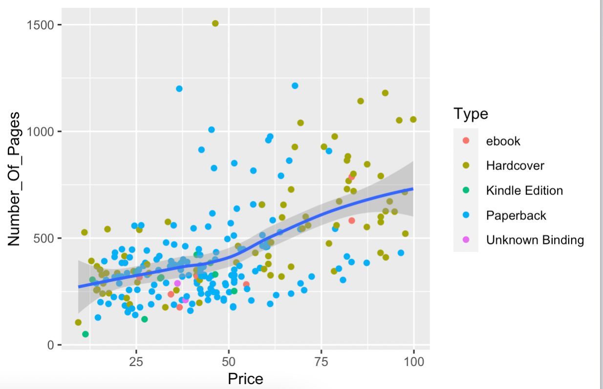
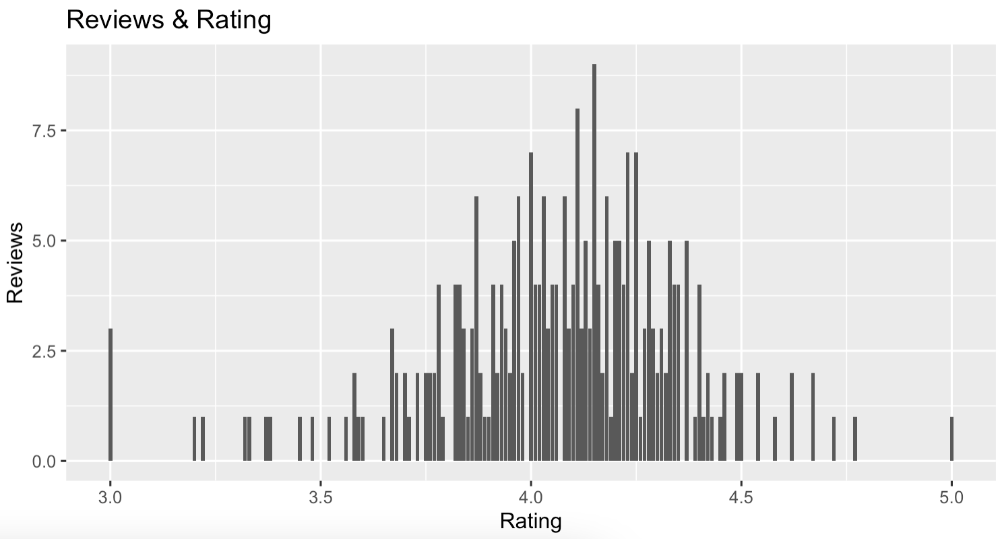

# Part 4: Visualization with GGplot2

## Import Libary `library(ggplot2)` a library will help you create graph in R
```{R}
library(ggplot2)
```

### 1.) Graph show relation between Price and Number_Of_Pages
```{R}
scat_plot <- prog_book %>% filter(Price<100) %>% ggplot(aes(x=Price,y=Number_Of_Pages))+
  geom_point(aes(color=Type))
scat_plot+geom_smooth()
```
Result:




### 2.) Graph show relation between Rating and Reviews
```{R}
bar_plot <- ggplot(prog_book,aes(x=Rating)) + geom_bar()
bar_plot + ggtitle("Reviews & Rating") +
  xlab("Rating") + ylab("Reviews") 
```
Result:



And then I use tools : Power BI to make a graph [click here](https://app.powerbi.com/view?r=eyJrIjoiOWRlMjA5ZDgtMWUwNS00YTM0LTkyNmUtMWFiMzIzNzJmOTJmIiwidCI6IjZmNDQzMmRjLTIwZDItNDQxZC1iMWRiLWFjMzM4MGJhNjMzZCIsImMiOjEwfQ%3D%3D&pageName=ReportSection)
